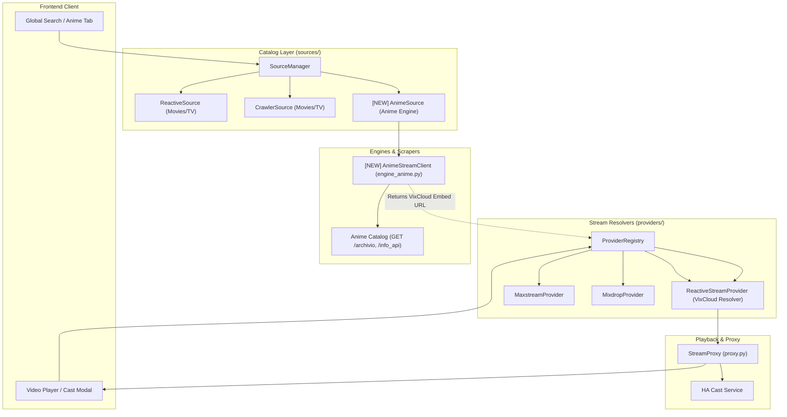

# Architectural Specification & Implementation Plan: Anime Streaming Engine Integration

## 1. Executive Summary & Objective

This document outlines the architectural plan for integrating a dedicated Anime streaming provider into `streaming-hub-ha`. 
The integration introduces a specialized catalog engine (`AnimeSource` / `engine_anime.py`) designed to interface with Laravel/Vue-based anime streaming catalogs, while leveraging the existing high-performance HLS/VixCloud stream resolution and proxy pipeline.

> [!NOTE]
> In accordance with privacy and architectural abstraction guidelines, external provider domain names and proprietary mirrors are not hardcoded. The engine is modeled as an abstract, configurable streaming source (`type: anime`) that can be instantiated with any compatible endpoint configured by the user.

---

## 2. Analysis of Existing Architecture vs. Target Source

### 2.1 Current Architecture Review
1. **Catalog Sources (`streaming_hub/backend/sources/`)**:
   - `BaseSource`: Abstract interface defining catalog operations (`get_latest_movies`, `get_latest_tv`, `search`, `get_details`, `get_season`, `resolve_stream`, `get_carousels`).
   - `SourceManager`: Orchestrates parallel queries across active sources, deduplicates titles via `CatalogMerger`, and implements fallback resolution (`resolve_stream_with_fallback`).
   - `ReactiveSource` (`engine_reactive.py`): Interfaces with Inertia.js SPAs.
   - `CrawlerSource` (`engine_crawler.py` + `crawler_parser.py`): Interfaces with semantic HTML WordPress catalogs.
2. **Stream Resolvers (`streaming_hub/backend/providers/`)**:
   - `StreamingProvider` & `ProviderRegistry`: Map embed URLs to direct playback streams (`ResolvedMedia`).
   - `ReactiveStreamProvider`: Resolves VixCloud / SCWS HLS streams.
   - `MaxstreamProvider` & `MixdropProvider`: Resolves external video hosters.
3. **Stream Proxy & Playback (`streaming_hub/backend/proxy.py`)**:
   - Ingress-compatible reverse proxy with AES-128 key rewrite and dynamic header injection (`Referer`, `User-Agent`).
   - Dedicated local LAN Cast endpoint for Chromecast and Home Assistant `media_player` devices.

### 2.2 Target Provider Technical Profile
- **Catalog Architecture**: Hybrid Laravel Blade + Vue.js components.
- **Search & Catalog API**:
  - Direct GET search: `/archivio?title={query}` (HTML response containing embedded JSON in `<archivio records="[...]" ...>`).
  - Catalog filtering: `/archivio/get-animes` (POST JSON supporting filters: type, status, dub, genre, season).
- **Episode & Season Model**:
  - API endpoint: `GET /info_api/{anime_id}/{episode_number}?start_range={start}&end_range={end}` (step 120, open JSON API).
  - Audio versions (SUB ITA vs. ITA) exist as distinct catalog entries (`dub: 0` for SUB ITA, `dub: 1` for DUB ITA).
- **Stream Delivery**:
  - Embed endpoint: `GET /embed-url/{episode_id}` -> returns VixCloud embed URL with signed token.
  - VixCloud Player: Uses `window.masterPlaylist` with HLS AES-128 stream encryption and direct MP4 fallback.

### 2.3 Synergies & Architectural Symbiosis


- **Zero Host Resolver Overhead**: Because the target source uses VixCloud as its video delivery backend, the stream resolution integrates directly into the existing `ReactiveStreamProvider` / `engine_reactive.py` resolution pipeline.
- **Unified Proxy**: The existing `StreamProxy` handles AES-128 HLS decrypt keys and chunk relaying without requiring custom video player changes.

---

## 3. Integration Options & UI/UX Strategies

Three integration models are evaluated:

| Aspect | Option 1: Unified Catalog | Option 2: Dedicated "Anime" Section | Option 3: Hybrid Architecture (Recommended) |
| :--- | :--- | :--- | :--- |
| **Catalog Placement** | Mixed into "Film" and "Serie TV" tabs with "Animazione" genre tag. | Distinct "Anime" tab in top navbar. | Unified global search + Dedicated "Anime" navbar tab + Home Carousels integration. |
| **Search Experience** | Global search returns anime alongside standard movies/series. | Search restricted to or separated by tab. | Single search box queries all sources; results display type/language badges (`[ANIME]`, `[SUB ITA]`, `[ITA]`). |
| **Catalog Browsing** | Latest Anime appear in standard "Tutti" feed. | Clean, isolated catalog with anime-specific status/season filters. | "Tutti" features an editorial "Nuove Uscite Anime" carousel; "Anime" tab offers full catalog filtering. |
| **Language Handling** | Displayed with title suffix (e.g. `(ITA)`). | Dedicated toggle chip (All / SUB ITA / ITA). | UI chip filter + Home Assistant configuration option for default language preference. |

### Recommended Solution: Hybrid Architecture (Option 3)
1. **Frontend Navigation**: Add an "Anime" view (`data-type="anime"`) to the navigation header, enabled when at least one anime source is registered.
2. **Global Search**: Search queries automatically query the anime source concurrently with existing movie/tv sources. Results are seamlessly merged with distinctive media badges.
3. **Dedicated Filters**: The Anime view provides quick toggles for `Tutti`, `SUB ITA`, and `Doppiati (ITA)`, as well as status (`In corso`, `Terminato`).
4. **Editorial Shelf**: The Home ("Tutti") view includes a dedicated horizontal carousel for trending anime releases.

---

## 4. Home Assistant & Configuration Settings

### 4.1 Options Schema (`streaming_hub/config.yaml`)
Enhance the add-on schema to natively support the anime source:

```yaml
schema:
  custom_sources:
    - url: url
      type: list(auto|reactive|crawler|anime)?
      name: str?
      enabled: bool?
  anime_preferred_language: list(all|dub_only|sub_only)?
  anime_enable_tab: bool?
```

- `type: anime`: Allows explicit declaration or auto-detection via `SourceDetector`.
- `anime_preferred_language`:
  - `all` (default): Show both original audio with Italian subtitles and Italian dubbed releases.
  - `dub_only`: Automatically hide `dub == 0` entries.
  - `sub_only`: Automatically hide `dub == 1` entries.
- `anime_enable_tab`: Boolean flag (default: `true`) to toggle the dedicated Anime tab in the frontend.

### 4.2 Auto-Detection in `SourceDetector` (`sources/detector.py`)
- Heuristic keyword detection: inspect domains containing anime keywords or specific provider indicators.
- Active HTTP probe: inspect response HTML for anime catalog indicators (`<archivio`, `item-anime`, `video-player anime=`).

---

## 5. Detailed Component Changes

### 5.1 Backend: Data Models (`streaming_hub/backend/models.py`)
- Add `is_anime: bool = False` and `dub_language: str | None = None` to `Movie` and `TvSeries`.
- Ensure `TvEpisode` stores `scws_id` and raw episode identifiers for direct VixCloud resolution.

### 5.2 Backend: Anime Engine Client (`streaming_hub/backend/engine_anime.py`) [NEW]
- Implement `AnimeStreamClient`:
  - `search(query: str) -> list[TvSeries | Movie]`
  - `get_latest_releases(page: int = 1) -> list[TvSeries | Movie]`
  - `get_anime_details(anime_id: int, slug: str) -> TvSeries | Movie`
  - `get_episodes_range(anime_id: int, start: int = 1, end: int = 120) -> list[TvEpisode]`
  - `get_embed_url(episode_id: int) -> str`

### 5.3 Backend: Catalog Source (`streaming_hub/backend/sources/anime_source.py`) [NEW]
- Implement `AnimeSource(BaseSource)`:
  - `source_id = "anime"`
  - `display_name = "Anime Engine"`
  - Methods mapping:
    - `get_latest_tv()` -> maps to TV anime series.
    - `get_latest_movies()` -> maps to anime movies.
    - `search()` -> queries `/archivio?title={query}`.
    - `get_details()` -> loads anime metadata and initial episode range.
    - `get_season()` -> loads paginated episode batches via `/info_api/`.
    - `resolve_stream()` -> obtains VixCloud embed URL and delegates to `ReactiveStreamProvider`.

### 5.4 Backend: Source Manager & Detector (`sources/manager.py` & `sources/detector.py`)
- Register `AnimeSource` in `SourceManager.init_sources()`.
- Add `'anime'` detection rule in `SourceDetector.detect_by_heuristic()` and `detect_by_probe()`.

### 5.5 Backend: API Routes (`streaming_hub/backend/main.py`)
- Update `/api/catalog/home`: include anime trending slider in carousels when anime source is active.
- Add `/api/catalog/anime`: endpoint dedicated to paginated anime catalog with filters (`dub`, `genre`, `status`).

### 5.6 Frontend: UI & Navigation (`streaming_hub/frontend/`)
- `index.html`:
  - Add `<button class="nav-btn" data-type="anime">Anime</button>` to top navigation.
  - Add sub-filter chips for Anime view (`Tutti`, `SUB ITA`, `ITA`, `In Corso`).
- `app.js`:
  - Handle `activeTab === 'anime'` to query `/api/catalog/anime`.
  - Add badge rendering on media cards: `badge-anime`, `badge-sub`, `badge-dub`.
  - Integrate anime episodes into season modal view.

---

## 6. Verification & Testing Strategy

### 6.1 Automated Testing (`pytest`)
- Unit tests for `AnimeStreamClient`:
  - Mock HTML `/archivio` response parsing.
  - Mock JSON `/info_api` episode range retrieval.
  - Test title cleaning, year extraction, and `dub` classification.
- Unit tests for `AnimeSource` in `SourceManager`:
  - Verify concurrent query merging with existing sources.
  - Verify fallback behavior when the anime source is unreachable.
- Test `SourceDetector`:
  - Verify heuristic detection and HTTP probe fingerprinting.

### 6.2 Manual Verification
- **Ingress & Standalone**: Test catalog navigation within Home Assistant Ingress iframe and standalone browser session.
- **Search**: Perform searches for popular anime and verify mixed results rendering.
- **Playback & Cast**:
  - Play an episode in the local web player (HLS AES-128 via `StreamProxy`).
  - Cast an episode to a Google Cast / Android TV device via Home Assistant `media_player.play_media`.
- **Options Toggle**: Toggle `anime_preferred_language` in Home Assistant Add-on configuration and verify catalog filtering.
