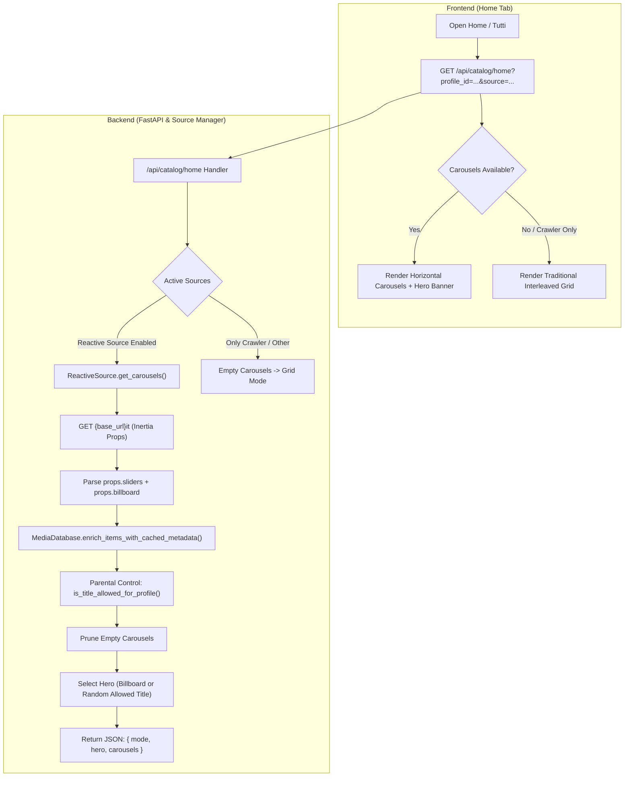

# Technical Specification: Home Carousels & Hero Banner Architecture

## 1. Overview & Objectives

StreamingHub's catalog on the Home view ("Tutti") historically fetched `/it/movies` and `/it/tv-shows` from the reactive streaming source, re-sorted the titles by `(year, rating)`, and interleaved them into a unified flat grid (`[Movie 1, TV Series 1, Movie 2, ...]`). Furthermore, the Hero Banner simply selected the first index of this sorted list (`catalogItems[0]`).

This document describes the implementation of:
1. **Thematic and Editorial Carousels for Home ("Tutti")**: Mirroring the layout of the reactive source's actual homepage (e.g., "Di Tendenza", "Nuove Uscite", "Top 10", "Film del Momento", "Serie del Momento") using horizontal scrolling shelves with the exact title sequence provided by the source.
2. **Conditional Source Behavior**:
   - When `ReactiveSource` is active: render the editorial carousels on the Home tab.
   - When only `CrawlerSource` is active: keep the existing merged grid mode, as `CrawlerSource` does not expose editorial carousels.
   - If no carousels are returned or errors occur: gracefully fall back to the existing interleaved grid layout.
3. **Dedicated Views for Categories**: Retain the standard paginated grid for the "Film" and "Serie TV" tabs, genre views, and search queries.
4. **Parental Control Enforcement**:
   - Filter every title within each carousel against the active profile's rating limit (`is_title_allowed_for_profile`).
   - If filtering removes all titles from a carousel, prune the empty carousel entirely from the display.
5. **Hero Banner Revision**:
   - Clarify the origin of the Hero Banner (internal client-side spotlight, not provided by Home Assistant).
   - Dynamically select the spotlight item: prioritize the editorial `billboard` or first item of the featured home slider if present, or dynamically select a random movie/series with a high-resolution backdrop and rating $\ge 7.0$ among profile-approved catalog items.
6. **Exclusion of Unreleased & Upcoming Titles**:
   - Automatically prune sliders dedicated to upcoming content (`upcoming`, `coming_soon`, `prossimamente`, `in_arrivo`).
   - Exclude any individual title flagged with `coming_soon == True` or unpopulated stream availability (`uploaded_at is None`), ensuring all displayed catalog titles are immediately playable.

---

## 2. Architecture & Data Flow

---

## 3. Detailed Component Changes

### 3.1 Backend: `streaming_hub/backend/engine_reactive.py`
- Add `get_homepage_carousels(self) -> tuple[dict[str, Any] | None, list[dict[str, Any]]]`:
  - Issues `GET {self.base_url}it` with Inertia headers (`X-Inertia: true`, `X-Inertia-Version`).
  - Parses `data-page` or raw JSON Inertia props.
  - Extracts `billboard` or featured item if available.
  - Iterates over `sliders = props.get("sliders", [])`:
    - Normalizes slider names and labels to clean Italian titles (e.g. `"latest"` -> `"Nuove Uscite"`, `"trending"` -> `"Di Tendenza"`, `"top_10"` -> `"Top 10 della Settimana"`).
    - Preserves the original site order of items (without forced `sort(year, rating)`).
    - Converts raw items to `Movie` or `TvSeries` instances using `_item_to_movie` / `_item_to_tv_series`.

### 3.2 Backend: `streaming_hub/backend/sources/base.py` & `reactive_source.py`
- In `BaseSource`:
  - `@property def has_carousels(self) -> bool: return False`
  - `async def get_carousels(self) -> tuple[Movie | TvSeries | None, list[dict[str, Any]]]: return (None, [])`
- In `ReactiveSource`:
  - `@property def has_carousels(self) -> bool: return True`
  - Implement `get_carousels()` delegating to `_client.get_homepage_carousels()`.

### 3.3 Backend: `streaming_hub/backend/sources/manager.py`
- In `SourceManager`:
  - Implement `get_home_carousels(self, source_filter: str = "all") -> tuple[Movie | TvSeries | None, list[dict[str, Any]]]`.
  - Determines if a source with `has_carousels == True` is active.
  - If yes, fetches carousels from that source.
  - If only crawler sources are active, returns `(None, [])`.

### 3.4 Backend: `streaming_hub/backend/main.py`
- Implement `GET /api/catalog/home`:
  - Resolves active profile and rating limits.
  - Queries `source_manager.get_home_carousels(source_filter=source)`.
  - Enriches all carousel items via `db.enrich_items_with_cached_metadata()`.
  - Applies `is_title_allowed_for_profile()` to each item.
  - Drops any carousel that ends up with 0 items.
  - Evaluates `hero_item`: if missing or blocked by rating filter, randomly selects an allowed item from the carousels with a valid backdrop and rating $\ge 7.0$.
  - Returns `{ "mode": "carousels", "hero": ..., "carousels": [...] }` or `{ "mode": "grid", "hero": ..., "carousels": [] }`.

### 3.5 Frontend: `index.html`, `style.css`, and `app.js`
- `index.html`: Add `#catalog-carousels` container inside `.catalog-section`.
- `style.css`: Add styling for `.catalog-carousels`, `.carousel-header`, and polish `.horizontal-scroll`.
- `app.js`: In `loadCatalog()`, if `isHome`, query `/api/catalog/home`. If `mode === "carousels"` and carousels are present, render each carousel shelf and populate Hero. Otherwise, toggle back to the traditional grid.
- Keep "Film" and "Serie TV" tabs strictly on the standard paginated grid.

---

## 4. Testing & Verification

- `tests/test_home_carousels.py`:
  - Test Inertia homepage parser with mock sliders and billboard.
  - Test order preservation of titles.
  - Test Parental Control filtering and empty carousel pruning.
  - Test single-source crawler fallback to grid mode.
  - Test Hero Banner selection and child profile safety.
- Verify full test suite passes without regressions.
